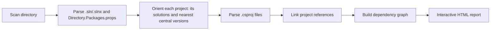

# DepLens

**See every solution, project and NuGet package in your codebase — with Central Package Management resolved — in one interactive report.**

DepLens is a dependency-analysis engine for .NET codebases, with a growing set of front ends built on top of it. Today that's a command-line tool; a desktop (Windows Forms) UI is on the roadmap.

[](https://www.nuget.org/packages/ImanSoftware.DepLens.Cli)
[](https://www.nuget.org/packages/ImanSoftware.DepLens.Cli)
[](LICENSE.txt)


Point DepLens at a folder — a single repo or a whole monorepo with several solutions — and it produces one self-contained HTML file you can open in any browser. No server, no restore step, no configuration.

## Why DepLens?

`dotnet list package` tells you what one project references. DepLens shows the whole picture at once:

- **Solution-aware.** Scans a directory containing many `.sln` / `.slnx` files and draws each solution as its own group. A project that belongs to two solutions sits in the overlap.
- **Central Package Management, done right.** Finds the nearest `Directory.Packages.props` for each project, honors per-project opt-out and `VersionOverride`, and shows *where* every version came from.
- **Two views of the same data.** A package-level dependency graph, and a solution-architecture view that shows only project-to-project direction.
- **Explorable.** A collapsible tree sidebar stays in sync with the graph: click a node and the tree expands to it; click a tree item and the graph highlights its relationships.

## Installation

DepLens is a .NET global tool and requires the **.NET 10** runtime.

```bash
dotnet tool install --global ImanSoftware.DepLens.Cli
```

Verify:

```bash
deplens --version
```

## Usage

Analyze the current directory:

```bash
deplens analyze
```

Analyze a specific directory (it must be a **directory**, not a `.sln` or `.csproj` file):

```bash
deplens analyze "C:\Projects\MyApp"
```

Choose where the report is written (defaults to the analyzed directory):

```bash
deplens analyze "C:\Projects\MyApp" --output ".\reports"
# or
deplens analyze "C:\Projects\MyApp" -o ".\reports"
```

Example output:

```text
────────────────────────────────────────────── DepLens
Scanning : C:\Projects\MyApp
Output   : C:\Projects\MyApp

✓ Analyzed 12 project(s)
✓ Report: C:\Projects\MyApp\dependency-graph.html

Open: C:\Projects\MyApp\dependency-graph.html
```

Open `dependency-graph.html` in a browser. The report is a single file; D3.js and the web fonts are loaded from CDNs, so you need an internet connection when you open it.

## What it detects

**Projects**
- `ProjectReference` relationships between projects
- Membership of each project in one or more solutions (`.sln` and `.slnx`)
- References to projects outside the scanned directory (shown, but not analyzed further)

**NuGet packages**
- `PackageReference` dependencies per project, with resolved versions
- Where each version comes from: explicit in the `.csproj`, Central Package Management, or `VersionOverride`
- Packages that flow in through `ProjectReference` chains, marked as transitive

## How it works



Every stage is a small, separate service, so each is easy to read, change, or replace.

A few behaviors worth knowing:

- **Generated and tool files are excluded.** Files below `bin`, `obj`, `.git`, `.vs`, `.idea`, and `node_modules` within the scan root are not read or analyzed. Directory names are matched case-insensitively; similarly named directories and the scan root's ancestors are unaffected. Directory enumeration still visits those folders.
- **Central versions are per project, not per solution.** Like MSBuild, DepLens uses the *nearest* `Directory.Packages.props` above each project. A project opts out with `<ManagePackageVersionsCentrally>false</ManagePackageVersionsCentrally>`.
- **Renamed project files are tolerated.** If a `ProjectReference` or solution entry points to a `.csproj` that no longer exists by that name, but the target folder contains exactly one discovered project, DepLens resolves to it.

## Known limitations

DepLens is young. Here is what it does not do yet:

- Transitive **packages** are derived from `ProjectReference` chains. A NuGet package's own dependencies are not resolved yet.
- Only `.csproj` projects are analyzed (no `.fsproj` / `.vbproj`).
- MSBuild properties inside versions (for example `$(SomeVersion)`) are not expanded, and `Directory.Build.props` is not applied.
- Cycle and version-conflict detection are not implemented (see the roadmap).

## Roadmap

- [ ] Windows Forms desktop UI (in addition to the CLI)
- [ ] Dependency cycle detection
- [ ] NuGet version conflict detection
- [ ] JSON output
- [ ] Additional report formats
- [ ] Dependency path analysis
- [ ] Architecture rules
- [ ] CI/CD integration
- [ ] Advanced graph filtering
- [ ] More dependency types (for example plain assembly references)

## Repository layout

```text
DepLens/
├── src/
│   ├── Core/
│   │   ├── ImanSoftware.DepLens.Abstractions/   # models and service contracts
│   │   └── ImanSoftware.DepLens.Core/           # scanner, parser, resolver, graph builder, HTML report
│   ├── UI/
│   │   └── ImanSoftware.DepLens.Cli/            # the `deplens` command-line tool (today's front end; a desktop UI is planned)
│   └── Playground/                              # console app for manual testing
├── Directory.Build.props
├── Directory.Packages.props
├── DepLens.slnx
└── LICENSE.txt
```

## Building from source

```bash
git clone https://github.com/ImanEstiri/DepLens.git
cd DepLens
dotnet build
```

Run the CLI directly from source:

```bash
dotnet run --project src/UI/ImanSoftware.DepLens.Cli -- analyze
dotnet run --project src/UI/ImanSoftware.DepLens.Cli -- analyze "C:\Projects\MyApp"
```

## Contributing

Contributions are welcome — bug reports, ideas, and pull requests alike.

- **Found a bug or have an idea?** Open an [issue](https://github.com/ImanEstiri/DepLens/issues). If you can, include a small example `.csproj`/`.sln` structure that reproduces it.
- **Want to code?** Look for issues labeled `good first issue` or `help wanted`, or pick something from the roadmap above and say so in an issue first.
- **Sending a pull request?** Keep it focused, make sure `dotnet build` passes, and describe what changed and why.

The pipeline is split into small services (`DirectoryScannerService`, `ParserService`, `ProjectOrienterService`, `ProjectReferenceLinkerService`, `DependencyGraphBuilderService`, `HtmlGraphReportService`), so most changes touch only one file.

## License

DepLens is released under the [MIT License](LICENSE.txt).
